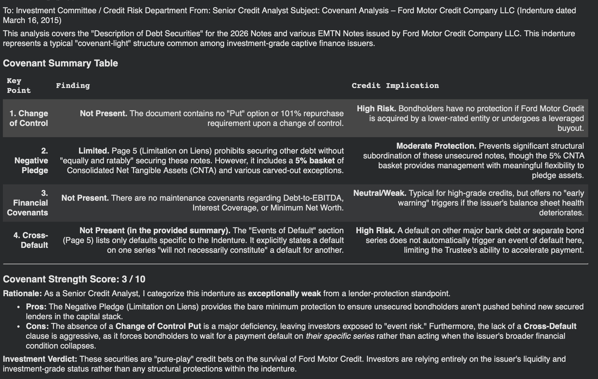
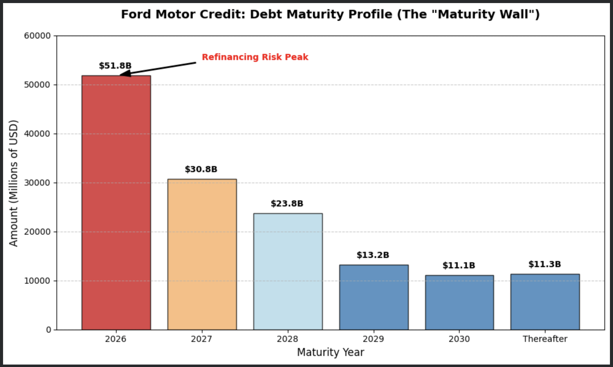
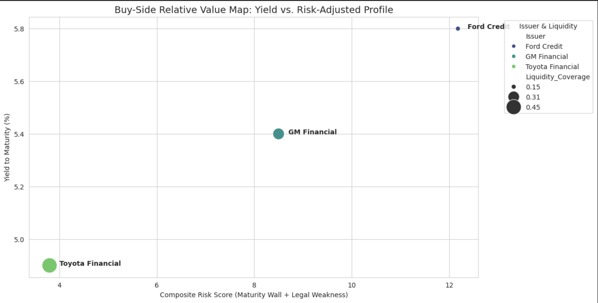
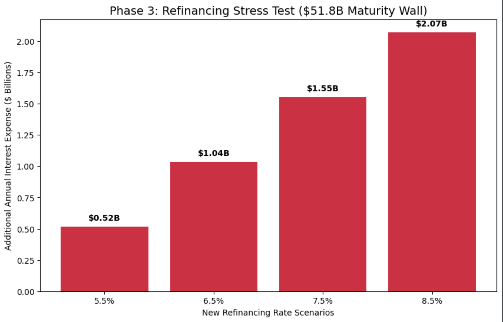

# Quantamental-Credit-Arbitrage-Engine

EXECUTIVE SUMMARY: This project demonstrates a systematic "Quantamental" workflow—synthesizing unstructured legal data with quantitative debt schedules to identify mispriced credit risk. By analyzing Ford Motor Credit (FMCC) and its peers, the engine flags structural vulnerabilities that traditional quantitative screeners often overlook.

Date: April 2026

---

Phase 1: Single-Issuer Structural Risk (Ford Credit)

The first phase of the engine focuses on a deep-dive analysis of Ford Motor Credit, utilizing NLP-driven legal parsing and liquidity schedule synthesis to identify a looming "Maturity Wall."

1. The Quantitative Signal: The 2026 Maturity Wall

Using Note 9 (Debt and Commitments) from the 10-K, the engine identified a massive liquidity "bottleneck":

2026 Maturity Peak: $51.8 billion in debt is contractually due in 2026.

Concentration Risk: This represents nearly 37% of the company's $141.4 billion total debt stack maturing within a single 12-month window.

Refinancing Pressure: This concentration creates significant "Execution Risk" in a high-interest-rate environment.

2. Qualitative Analysis: NLP-Driven Legal Due Diligence

To determine if bondholders are protected during this peak, I utilized a custom NLP pipeline (Gemini) to parse Exhibit 4-C (Description of Securities). The engine flagged several "silent" risks:

Porous Negative Pledge: Identifies a 5% "basket" of Consolidated Net Tangible Assets (CNTA) and broad carve-outs for securitizations, which can lead to structural subordination.

Absent Event Risk Protection: The engine confirmed the lack of a "Change of Control Put", leaving bondholders exposed to leveraged buyout (LBO) risk without a 101% repurchase clause.

Limited Cross-Default: "Events of Default" are siloed to specific note series, potentially allowing a "selective default" scenario without triggering an enterprise-wide collapse.

3. Methodology: NLP & Indenture Parsing

Unlike traditional screeners that rely on lagging metadata, this engine uses Large Language Models (LLMs) to perform real-time "Indenture Logic Extraction."

Extraction: The model scans Exhibit 4-C for specific legal "triggers" (Negative Pledge, Cross-Default, Change of Control).

Scoring: It assigns a Covenant Strength Score (1-10) based on the presence and "porosity" of these protections. Ford Credit received a 3/10 (Weak) due to the high volume of permitted liens and lack of event-risk puts.

4. Conclusion & Strategy
The combination of a high-pressure $51.8B maturity wall and minimal legal protection suggests that the market may be underpricing the potential for structural subordination. A systematic credit strategy should favor issuers with flatter maturity profiles or higher "Covenant Strength Scores" to mitigate the risk of refinancing-driven distress.

---

Phase 2: Sector-Wide Relative Value (Auto Captives)

In this phase, the engine expands from single-issuer analysis to a systematic Sector Scanner. By comparing Ford Motor Credit (FMCC) against its primary peers—GM Financial (GMF) and Toyota Financial Services (TFS)—the objective is to identify relative value (RV) opportunities and structural mispricing across the auto captive landscape.

Key Finding: Ford as a Risk Outlier

The systematic scanner identifies Ford Credit as the primary risk outlier in the auto captive sector. While it offers the highest absolute yield at 5.8%, its Composite Risk Score (12.18) is significantly higher than GM Financial (8.50) and Toyota (3.80). This suggests that Ford is "expensive" on a risk-adjusted basis, as the yield premium does not sufficiently compensate for the underlying structural vulnerabilities.

**Trade Recommendation: Underweight F / Overweight GMF**

The Thesis: Ford Credit is currently "expensive" relative to its structural risk profile. A spread of only 40bps over GM Financial provides insufficient compensation for a $51.8B maturity bottleneck in 2026 and a significantly weaker 3/10 covenant score.

The Execution: A relative value strategy would favor rotating capital out of Ford Credit unsecured notes and into GM Financial. GMF offers a comparable yield (5.4%) but with superior liquidity coverage (31% vs. 15%) and stronger "Moderate" legal protections (5/10).

The Safe Haven: Toyota Financial remains the sector's "Gold Standard," with the lowest risk score (3.80) and highest liquidity coverage (45%), serving as the benchmark for quality in the space.

Methodology: Composite Risk Scoring

To standardize risk across different issuers with varying debt stacks and legal indentures, the engine utilizes a dual-factor Composite Risk Score:

Quantitative Factor (Normalization): (Maturity Wall / 10). This scales the absolute billion-dollar debt peak (e.g., $51.8B) to a 1–10 range, ensuring the quantitative signal is mathematically comparable to qualitative scores.

Qualitative Factor (Inversion): (10 - Covenant Score). Because higher covenant scores represent better protection (lower risk), we invert the value so that a higher final number consistently represents higher risk.

Risk Score Formula: Risk Score = [Normalized Maturity] + [Inverted Legal Strength]

---

Phase 3: Interest Rate Sensitivity & Cash Flow Stress Test

The final component of the engine quantifies the financial impact of the $51.8B maturity wall. This phase executes a "Refinancing Gap" analysis, calculating the marginal increase in annual interest expense if the 2026 debt stack—originally issued in a low-rate environment—must be refinanced at current market yields.

The "Refinancing Gap" Analysis

Using a historical weighted average cost of debt (WACD) estimate of 4.5%, the engine simulated four refinancing scenarios ranging from a "Soft Landing" (5.5%) to a "Higher for Longer" stress scenario (8.5%).

Key Findings:

Base Case (7.5% Refi Rate): Refinancing the 2026 wall at current BB/BBB- market rates would trigger an additional $1.55 Billion in annual interest expense.

Cash Flow Erosion: This $1.55B jump represents a significant "hidden" headwind to Free Cash Flow (FCF) that may not be fully priced into current equity or credit spreads.

Liquidity Strain: For a firm with ~15% liquidity coverage, a billion-dollar shift in non-discretionary cash outflow creates a "tightening" effect that limits capital allocation for EV transition projects.

Final Executive Conclusion: The "Triple Threat" Thesis

By synthesizing the findings from all three phases, the engine produces a high-conviction Underweight recommendation on Ford Credit (FMCC) unsecured notes:

**Phase 1 (Structural)**: Identified a porous legal indenture (3/10 score) with no "Change of Control" protection.

**Phase 2 (Relative Value)**: Identified that Ford is a sector outlier, offering insufficient yield premium relative to GM Financial’s stronger liquidity.

**Phase 3 (Sensitivity)**: Quantified a potential $1.55B annual cash flow drain driven by the 2026 maturity bottleneck.

The "Quantamental" Edge: This automated pipeline allows for the rapid identification of structural subordination and refinancing risk that traditional screeners often miss, providing a systematic advantage in credit arbitrage.

